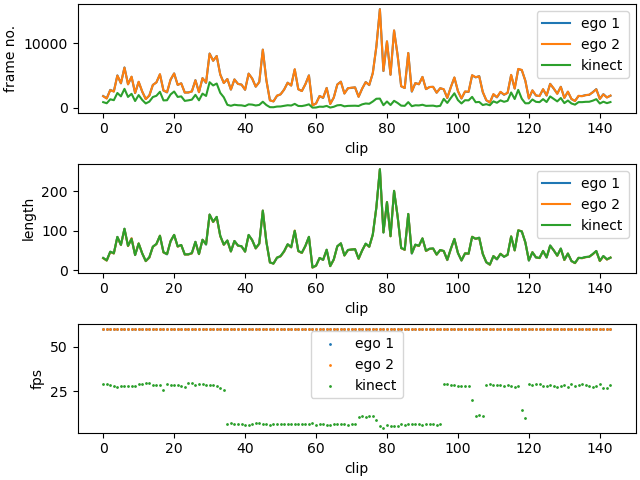
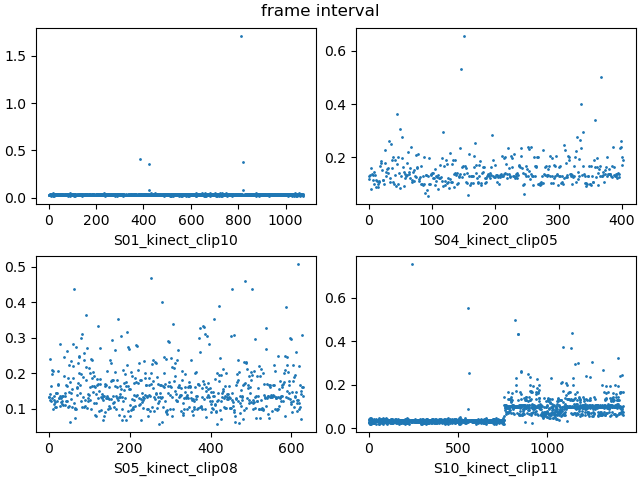

# MHHRI

## About the dataset

### Summary

- Setting(Num. of Partners): HHI(2) HRI(3)
- Num. of Subjects: 18
- Num. of Interaction Sessions: 48 (746 short clips) / 12 interaction session
- Multimodality: audio, video, depth, Electrodemal Activity (EDA), temperature, 3-axis wrist acceleration
- Annotations: self-/acquaintance-assessed personality, self-reported engagement

### Personality

Big Five Inventory-10 (BFI-10), a short version of the BFI.
- Extraversion, Agreeableness, Conscientiousness, Neuroticism, Openness
- 10 questions, score 1-5, range 2-10
    - Extraversion: 1R, 6
    - Agreeableness: 2, 7R
    - Conscientiousness: 3R, 8
    - Neuroticism: 4R, 9
    - Openness: 5R; 10

### Engagement, robot’s behaviours, and abilities

- Engagement (with human), Believability, Valence, Extroversion, Empathy, Capability, Engagement (with robot)
- 10 questions, score 1-10

### Baseline

- Celiktutan, Oya, Efstratios Skordos, and Hatice Gunes. “Multimodal Human-Human-Robot Interactions (MHHRI) Dataset for Studying Personality and Engagement.” IEEE Transactions on Affective Computing, 2019, 484–97. https://doi.org/10.1109/taffc.2017.2737019.
    - problem: binary classification
    - method: SVMs
    - features: Audio, Physiological, First Person Vision, Second-Person Vision

- Romeo, Marta, Daniel Hernández García, Ting Han, Angelo Cangelosi, and Kristiina Jokinen. “Predicting Apparent Personality from Body Language: Benchmarking Deep Learning Architectures for Adaptive Social Human–Robot Interaction.” Advanced Robotics, 2021. https://doi.org/10.1080/01691864.2021.1974941.
    - problem: binary classification
    - method: 3DCNN, 3DResNet, VGG DAN+, CNN + LSTM
    - features: cropped 16-frame clip (128x128)

### Limitations

- unbalanced
- less informative than ideal: participants were too few and they were always portrayed in each frame sitting in front of each other, engaging in scripted conversation. This led to fewer movements, gestures and body shifts throughout the dataset.

## Our process
### Folder structure

- annotations
- assets
- hhi_ego
- hhi_ego_images
- hhi_kinect
- hhi_kinect_cropped
- removed

### Data info

- [hhi_ego](./data_summary/hhi_ego.csv), [hhi_ego_concate](./data_summary/hhi_ego_concate.csv)
- [hhi_kinect](./data_summary/hhi_kinect.csv)

### Profiles

### Ego-view and Kinect data overview

Data summary about the frame number, clip length, and fps.

### Four samples of clip frame interval

